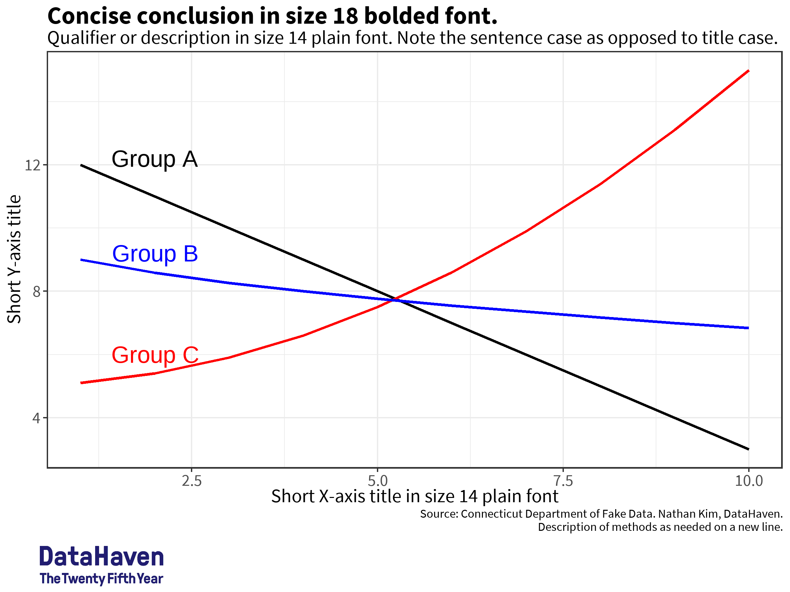

```{r setup, include=FALSE}
knitr::opts_chunk$set(echo = F, 
                      message = F, 
                      warning = F)
library(tidyverse)
library(sysfonts)
library(showtext)
library(scales)
```

# Introduction


Data visualization and any sort of analysis is never purely objective. There is always a story we want to communicate, a trend we want to show above others, a subgroup we want to highlight — in all cases, an opinionated project. As a community-oriented nonprofit, Datahaven is driven by the need to make data accessible and interpretable, and be used to advance justice, eliminate inequity, and promote the well-being of all. 

In this effort, we recognize that the styling and aesthetic portions of plots are just as substantive as the quantitative trends that we show, and everything about style must service this goal. 

In less abstract terms, this means:

* Identifying trends in our data that we’d like to highlight.
* Organizing data and selecting variables that will display this in a meaningful and interpretable way. 
* Highlighting them through deliberate use of text, colors, and facets.

Finally, Datahaven makes a ton of graphics of different facets, messages, and target audiences. As a result, there aren’t hard-and-fast rules for how big you should make your text, what your go-to colors would be, and so on. This style guide is still just a guide for how to think about effective presentation, with several examples to assist. 

# Text

Text is probably the most explicit way to communicate a message through your plot. There are also many different kinds and uses for text, and many characteristics to consider with each choice. Finally, considering that many of Datahaven’s graphics are public-facing and have broad audiences, a clear message through text is essential to making graphics accessible and interpretable.  

* **Title.**  In almost every graphic, the title should be a noticeable statement that aids in interpretation. This means that it should ideally be a sentence that states a conclusion — instead of “Preventable hospital visits across age and gender,” a better title could be “Preventable hospital visits show large differences across age and gender.” It should be in bold and be the biggest piece of text in the plot (18 or larger), and left-aligned at the top of the plot. 
* **Subtitle.** The subtitle should be a qualifier that adds context or detail to the title. It should be the second-largest piece of text in the plot, and left-aligned just below the plot title. It should also be noticeably different from the plot title; usually this can be accomplished by just using plain (as opposed to bold) face, but you can also use capital case or a different color if necessary. 
* **Caption.** The caption functions similarly to the subtitle in adding context and detail, but is useful more for information that the user might not need immediately. These include  credits to the maker of the data and/or graphic. Many graphics might not need captions and might function better without them if they add clutter; for example, there are very few captions for Datahaven’s 2019 CWI and most of this information is instead stored in footnotes at the end of the report. When they are used, they should be right-aligned and smaller than the subtitle and axis labels. 
* **Axis titles.** Contrary to what your science teachers might tell you, axis titles are actually *not always needed.* If the x-axis only has four slots for “Asian”, “Black”, “Latino”, and “white”, you shouldn’t use “Race” as an axis title because it only adds clutter instead of useful information. This is especially true if the title of the plot primes the user for information the axis title might convey-- for example, if the title was “Pandemic-related income loss has hit non-white adults hardest" and the x-axis was "race." 
  + Still, in some cases they are necessary. Amounts of money as tick marks could mean median household income, income per capita, cost of living in a town, or others, and it may be impossible to distinguish based on context. In these cases, axis titles should be bigger than the axis tick labels but smaller than the plot title. Choosing the same size as the plot subtitle is usually a safe bet. They should be concise. 
* **Axis tick labels.** Axis tick labels should be formatted in a "friendly" manner. Use dollar signs, commas as thousand separators, and use decimal points judiciously. Especially important are tick labels where the peaks or valleys of the plots might be -- other tick labels aren't as important. You generally don't need more than four tick labels per plot.
* **Legend text.** Legend text is useful to distinguish groups on the same page. But legends can also add clutter and it can be annoying for readers to constantly switch looking at the plot and the legend. Adding the legend text onto the plot itself as an annotation can be much more effective. 
* **Annotations.** Besides acting as a legend as we see in the two plots above, annotations can be helpful to highlight specific groups or point out special cases. In a line plot of Connecticut towns, we might want to highlight the “overall” line or the “New Haven” line. Annotations can assist in this effort. 
  + Because annotations go directly onto the plot, it can be really easy to add clutter and obscure the message the facets show. When annotations are used in the plot whitespace, they should be relatively small (around the same size as the axis tick labels, or smaller) and be extremely short. 
* **Logo.** The Datahaven logo goes on plots that are not part of a long report but may reach a large audience. These might include Twitter graphics or in an op-ed. It should go in the bottom left corner beneath the axis labels and caption (i.e., at the very bottom of the plot). Use cowplot::plot_grid() to align the logo consistently across plots; a ratio of 10:1 for plot:logo height is safe for most rectangular plots. 

Although these classifications are useful to think about, there often aren’t clear boundaries between different types of text. Legend text can often be changed into annotations, and information reserved for the caption in some areas might work better as a subtitle in other areas. You should feel no qualms about breaking any of these rules if they assist in the overall goal of providing a simple, accessible graphic with a clear message. 

```{r}
font_add_google("Roboto Condensed") 
showtext_auto()
fake_data <- data.frame(x = 1:10, y = 5+.1*(1:10)^2, group = "group A") %>% 
  bind_rows(
    data.frame(x = 1:10, y = 10-(1:10)^.5, group = "group B"),
    data.frame(x = 1:10, y = 13-(1:10), group = "c")
  )

text_example_base <- fake_data %>% 
  ggplot(aes(x = x, y = y, color = group)) + 
  annotate("text", x = 2, y = 6, color = "red", label = "Group A", size = 6) + 
  annotate("text", x = 2, y = 9.2, color = "blue", label = "Group B", size = 6) + 
  annotate("text", x = 2, y = 12.2, color = "black", label = "Group C", size = 6) + 
  geom_line(size = 1) + 
  scale_color_manual(values = c("black","red", "blue")) + 
  labs(x = "X-axis title in size 14 plain font", 
       y = "Y-axis title", 
       title = "Concise conclusion in size 18 bolded font", 
       subtitle = "Qualifier or Description in size 14 plain font", 
       caption = "Source: Connecticut Department of Fake Data. Nathan Kim, Datahaven."
       ) + 
  theme(text = element_text(family = "Roboto Condensed"), 
        plot.title = element_text(size = 18 , face = "bold"), 
        plot.subtitle = element_text(size = 14), 
        panel.background = element_blank(), 
        panel.border = element_rect(fill = NA, size = 1),
        axis.title = element_text(size = 14), 
        legend.position = "none", 
        axis.text = element_text(size = 12), 
        legend.key = element_rect(fill = NA), 
        )

logo <- cowplot::ggdraw() + 
  cowplot::draw_image("examples/25th_logo_alpha.png", x = 0, hjust = 0, width = 0.25) +
  theme(plot.margin = margin(0.05, 0.05, 0.05, 0.05, "in"))

text_example_plot <- cowplot::plot_grid(text_example_base, logo,
                                   ncol = 1, rel_heights = c(10, 1))
ggsave("examples/text_plot.png", plot = text_example_plot, width = 4, height =3, dpi = 300)
```



## A note on fonts 

Fonts for Datahaven graphics should be chosen in a “standard”-looking, clean,  very readable font. The Datahaven Community Wellbeing Index (CWI) reports use Barlow Semi Condensed, and PT Sans. Roboto Condensed is another great one, and the default for hrbrthemes::theme_ipsum_rc() and camiller::theme_din(). Source Sans Pro also works. 

You can use any of these with `sysfonts::font_add_google()` and `sysfonts::font_load()`. 

# Colors

There are two main (related) points to consider in choosing colors: accessibility and semantic meaning. 


```{r}
#changed just one line of show_col lol
display_col <- function (colours, labels = TRUE, borders = NULL, cex_label = 1, 
    ncol = NULL) 
{
    n <- length(colours)
    ncol <- ncol %||% ceiling(sqrt(length(colours)))
    nrow <- ceiling(n/ncol)
    colours <- c(colours, rep(NA, nrow * ncol - length(colours)))
    colours <- matrix(colours, ncol = ncol, byrow = TRUE)
    old <- par(pty = "s", mar = c(0, 0, 0, 0))
    on.exit(par(old))
    size <- max(dim(colours))
    plot(c(0, size), c(0, -.3), type = "n", xlab = "", 
        ylab = "", axes = FALSE)
    rect(col(colours) - 1, -row(colours) + 1, col(colours), -row(colours), 
        col = colours, border = borders)
    if (labels) {
        hcl <- farver::decode_colour(colours, "rgb", "hcl")
        label_col <- ifelse(hcl[, "l"] > 50, "black", 
            "white")
        text(col(colours) - 0.5, -row(colours) + 0.5, colours, 
            cex = cex_label, col = label_col)
    }
}
#greens 
#'#f0eeaa', '#c0d889', '#98c082', '#72a680', '#4d8b7e', '#277278', '#015969'
#purp_yl

# 1 color
show_col("#00A796", ncol =1)
show_col("#104E8B", ncol = 1)
# 2 colors
#F0B537
#C15FA5

#00A796
#F68B33

#C15FA5
#75BEE9

# 3 colors
#75BEE9
#F3716D
#C15FA5

#99C945
#CC61B0
#2F8AC4

#4
#00A796
#F3716D
#C15FA5
#75BEE9


#F68B33
#0077C1
#00A796
#C05FA5

#5
#00A796
#F17060
#C15FA5
#F0B537
#75BEE9

# "#008080" "#92b69e" "#f6edbd" "#e6a272" "#ca562c"
```

### Accessibility

Colorblindness affects around 1/12 of men or those with a single X chromosome, and around 1 in 200 of those who have 2 X chromosomes. Some of the most common forms of colorblindness include protanopia and deuteranopia, or red-green colorblindness, and tritanopia, or reduced blue light sensitivity.

```{r, echo=FALSE, out.width="49%", out.height="25%",fig.cap="Standard vision (top left), deuternaopia (top right), proteranopia (bottom)",fig.show='hold',fig.align='center'}
knitr::include_graphics(c("examples/colors/iris_colors_base.png",
                          "examples/colors/iris_colors_deut.png", 
                          "examples/colors/iris_colors_pro.png"))

``` 

Picking colors like red and green in a single plot can make it difficult or impossible to distinguish colors on that chart. Even in cases where it is possible to distinguish colors, the trends we want to highlight may lose impact or change meaning if the colors change drastically. To ensure that our graphics are accessible as possible, you should choose easily distinguishable colors and review your plots in software like [Sim Daltonism](https://apps.apple.com/us/app/sim-daltonism/id693112260?mt=12) (Mac) or [ColourSimulations](https://www.microsoft.com/en-us/p/coloursimulations/9nblggh4385h) (Windows) before publishing. 

### Semantic meaning 

The other dimension to color choices is the semantic meaning colors can have, or in other words the message that a combination of colors can send. Some scales can be used to match intuitive notions of a metric — for example, I can color towns with a “good” COVID-19 response green, “okay” as yellow, and “bad” as red. Others need more caution — for instance, red and blue are often associated with Republican/Democrat divisions, which can be useful in showing explicitly political trends (who won in this town in 2016?) but harmful for characterizing other divisions (is this a low-income or high-income town?). Still other divisions similarly play into cultural norms and color association, but should in almost every case be avoided when discussing their associated dimensions (e.g., don’t use pink and blue for gender). 

Broader connotations outside of any specific combination of colors should also be considered. Noticeably brighter or darker colors generally stick out more, which can be very useful when highlighting a certain trend. Bright red might be connoted with “wrong” no matter what other colors are used. Blue and green are called “cool” colors because of their emotional connotation. 

### More useful information

Here are some go-to palettes that can be your starting point: 

[insert color schemes]

# Guides for Individual Geoms

*Geom* is *ggplot2* lingo for "geometric object" or "the type of symbols that represent the data." Geoms differentiate scatter plots from line plots, bar plots from box plots, and so on. 

### Bar plots (`geom_bar` and `geom_col`)

Bar plots are one of Datahaven's quintessential plots. Both stacked bar plots and "dodge"d bar plots are useful for showing within- and between-group differences in data -- it's easy to look at a bar plot and see that one bar is taller than the others. Because of this, bar plots are a generally reliable go-to option when dealing with data that have at least one continuous variable and one categorical variable. Stacked bar plots in particular are a good way to represent "shares of a whole," as in example 3. 

With bar plots, you should try to make sure that the continuous axis begins at zero with `lims()`. Differences and disparities with bar plots can be easily misinterpreted by just adjusting the minimum value of the y-axis -- see example 3. 

### Maps (`geom_sf`^[There are some other ideas floating around on blogs, like `geom_polygon` or even `ggmap`. Don't use those! Simple features are the future, and the future is now!])

Maps are a beautiful and usually intuitive way to show geographic trends. When maps are used, you should:

* Ask if the trend you communicate is truly geographic. [finish]
* Set polygon boundaries to an appropriately small size and color. They should be visible but very subtle, and not detract at all from the colored interior. You should also consider a dark border around the entire shape, which can 
* Be extremely cautious about colors! Whereas five or six colors might be able to be used with extreme caution in bar plots and line plots, even just two different colors can be difficult for a map. You should always try to use a sequential color scale, a diverging color scale only when necessary, and a categorical scale almost never. 

### Line plots (`geom_line` and `geom_smooth`)

Compared to scatter plots, line plots emphasize a trend of the same object over some ordered measure. Just the act of connecting multiple dots is itself a pointed statement — you argue that there is an underlying trend, instead of opting to let the data “speak for itself”^[again, not a real concept] as one might try with a scatter plot. 

Like any plot, you should always work to simplify the information your plot shows. As opposed to creating a “cloud” of lines for every block group in Connecticut (see example 1), a more reasonable option might be using a 95% confidence interval of the mean to show a clear and convincing trend. 

This can be difficult if the data you want to plot is all over the place. Aggregation, like the 7-day rolling average in example 2, can be helpful for this purpose. `geom_smooth` can also help pull out a trend from messy data, but this is less optimal because [finish]

[add some more]

### Scatter plots (`geom_point` and `geom_jitter`, sometimes)

Otherwise known as a scatter plot, `geom_point` and `geom_jitter` is useful for data with at least one continuous variable. They can communicate at once a trend and give an intuitive display of the variance or margin of error in the data. Scatter plots are notable for coming the closest to representing the data "as it is"^[though such a concept of the "true" data doesn't *reaaally* exist. All data is opinionated all the time, and all viz is opinionated all the time.], and [finish]

However, this minimalist "as it is" aspect of scatter plots is also a reason to stay away from them. To make sure our public-facing graphics can be understood by many, the message our plots convey should often be explicit and simple. It's hard to do this with scatter plots, where points can easily clutter the plot or overload the reader with information. It can often be hard to distinguish multiple groups in a scatter plot unless the alpha^[basically "transparency"] and size of points are carefully adjusted. Even when they are adjusted, colors may blend together to create unintended consequences (e.g. red point + blue point = purple point). Lastly, the benefits of nuance and complexity that scatter plots could give are often unnecessary and unhelpful for making messages clear and simple. 

As such, `geom_point` is useful for initial exploratory plots, but should generally be reworked into another form by the publication stage.

### Examples


