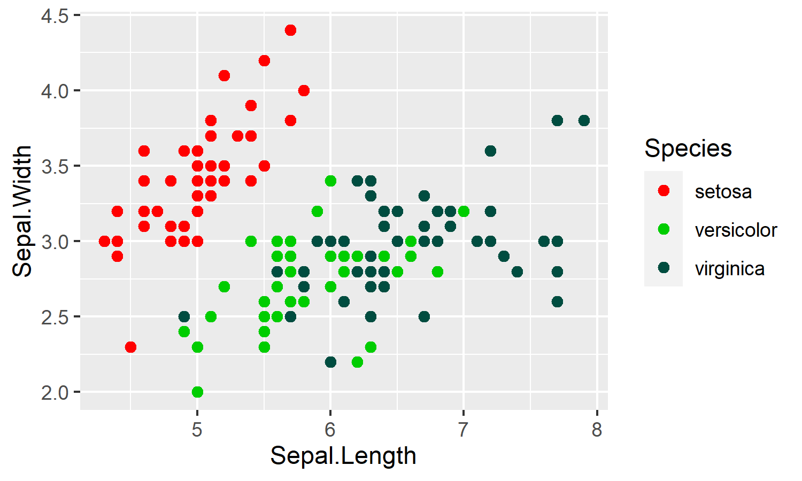
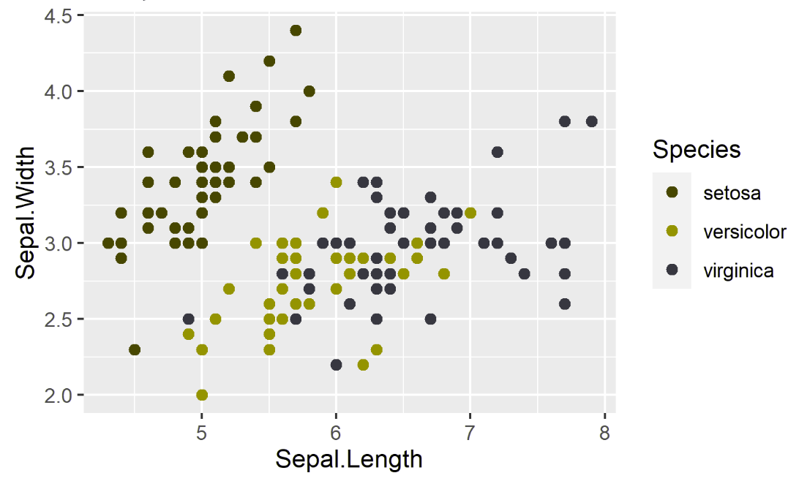
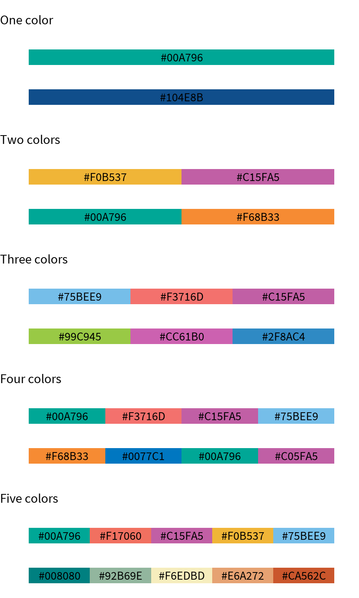
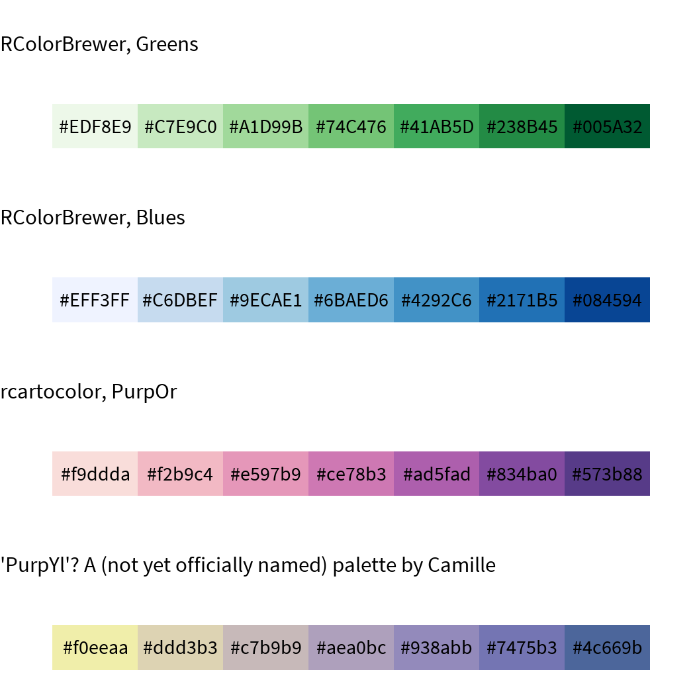

DataHaven Style Guide for Plots
================
Nathan
7/15/2020

# Introduction

Data visualization is never purely objective. There is always a story we
want to communicate, a trend we want to show above others, a subgroup we
want to highlight — in all cases, an opinionated project. As a nonprofit
using data for community action, DataHaven is driven by the need to make
data accessible and interpretable, and to have our products used to
advance justice, eliminate inequity, and promote the well-being of all.

In this effort, we recognize that the styling and aesthetic portions of
plots are just as substantive as the quantitative trends that we show,
and everything about style must service this goal.

In less abstract terms, this means that all of our plots should involve:

  - Identifying trends in our data that we’d like to highlight.
  - Selecting variables and measures that will display this in a
    meaningful and interpretable way.
  - Highlighting them through selective use of text, colors, and geoms.

This style guide addresses the third point in detail, but the first and
second point must be addressed for each plot that you make. Why do we
ever want to choose to use median household income instead of income per
capita or poverty rate? Why would we want to represent families instead
of individuals, or vice versa? Whether the plot-maker is conscious of
them or not, these decisions are constantly being made. It is up to us
to recognize how we can make these choices to create accessible
information for the public good.

Finally, DataHaven makes a ton of graphics of different topics,
messages, and target audiences. As a result, there aren’t hard-and-fast
rules for how big you should make your text, what your go-to colors
would be, and so on. This style guide is still just a guide for how to
think about effective presentation, with several examples to assist.

# Text

Text is probably the most explicit way to communicate a message through
your plot. There are also many different kinds and uses for text, and
many characteristics to consider with each choice. Finally, considering
that many of DataHaven’s graphics are public-facing and have broad
audiences, a clear message through text is essential to making graphics
accessible and interpretable.

\[this section will be turned into a nice table instead of bullet
points\]

  - **Title.** In almost every graphic, the title should be a noticeable
    statement that aids in interpretation. This means that it should
    ideally be a sentence that states a conclusion — instead of
    “Preventable hospital visits across age and gender,” a better
    title could be “Preventable hospital visits show large differences
    across age and gender.” It should be in bold and be the biggest
    piece of text in the plot (18 or larger), and left-aligned at the
    top of the plot.
  - **Subtitle.** The subtitle should be a qualifier that adds context
    or detail to the title. It should be the second-largest piece of
    text in the plot, and left-aligned just below the plot title. It
    should also be noticeably different from the plot title; usually
    this can be accomplished by just using plain (as opposed to bold)
    face, but you can also use capital case or a different color if
    necessary.
  - **Caption.** The caption functions similarly to the subtitle in
    adding context and detail, but is useful more for information that
    the user might not need immediately. These include credits to the
    maker of the data and/or graphic. Many graphics might not need
    captions and might function better without them if they add clutter;
    for example, there are very few captions for DataHaven’s 2019 CWI
    and most of this information is instead stored in footnotes at the
    end of the report. When they are used, they should be right-aligned
    and smaller than the subtitle and axis labels.
  - **Axis titles.** Contrary to what your science teachers might tell
    you, axis titles are actually *not always needed.* If the x-axis
    only has four slots for “Asian”, “Black”, “Latino”, and “white”, you
    shouldn’t use “Race” as an axis title because it only adds clutter
    instead of useful information. This is especially true if the title
    of the plot primes the user for information the axis title might
    convey– for example, if the title was “Pandemic-related income loss
    has hit non-white adults hardest” and the x-axis was “race.”
      - Still, in some cases they are necessary. Amounts of money as
        tick marks could mean median household income, income per
        capita, cost of living in a town, or others, and it may be
        impossible to distinguish based on context. In these cases, axis
        titles should be bigger than the axis tick labels but smaller
        than the plot title. Choosing the same size as the plot subtitle
        is usually a safe bet. They should be concise.
  - **Axis tick labels.** Axis tick labels should be formatted in a
    “friendly” manner. Use dollar signs, commas as thousand
    separators, and use decimal points judiciously. Especially important
    are tick labels where the peaks or valleys of the plots might be –
    other tick labels aren’t as important. You generally don’t need more
    than four tick labels per plot.
  - **Legend text.** Legend text is useful to distinguish groups on the
    same page. But legends can also add clutter and it can be annoying
    for readers to constantly switch looking at the plot and the legend.
    Adding the legend text onto the plot itself as an annotation can be
    much more effective.
  - **Annotations.** Besides acting as a legend as we see in the two
    plots above, annotations can be helpful to highlight specific groups
    or point out special cases. In a line plot of Connecticut towns, we
    might want to highlight the “overall” line or the “New Haven” line.
    Annotations can assist in this effort.
      - Because annotations go directly onto the plot, it can be really
        easy to add clutter and obscure the message the facets show.
        When annotations are used in the plot whitespace, they should be
        relatively small (around the same size as the axis tick labels,
        or smaller) and be extremely short.
  - **Logo.** The DataHaven logo goes on plots that are not part of a
    long report but may reach a large audience. These might include
    Twitter graphics or in an op-ed. It should go in the bottom left
    corner beneath the axis labels and caption (i.e., at the very bottom
    of the plot). Use cowplot::plot\_grid() to align the logo
    consistently across plots; a ratio of 10:1 for plot:logo height is
    safe for most rectangular plots.

Although these classifications are useful to think about, there often
aren’t clear boundaries between different types of text. Legend text can
often be changed into annotations, and information reserved for the
caption in some areas might work better as a subtitle in other areas.
You should feel no qualms about breaking any of these rules if they
assist in the overall goal of providing a simple, accessible graphic
with a clear message.

## A note on fonts

Fonts for DataHaven graphics should be chosen in a “standard”-looking,
clean, very readable font. The DataHaven Community Wellbeing Index (CWI)
reports use Barlow Semi Condensed, and PT Sans. Roboto Condensed is
another great one, and the default for hrbrthemes::theme\_ipsum\_rc()
and camiller::theme\_din(). Source Sans Pro also works.

You can use any of these with `sysfonts::font_add_google()` and
`sysfonts::font_load()`.

# Colors

There are two main (related) points to consider in choosing colors:
accessibility and semantic meaning.

### Accessibility

Colorblindness affects around 1/12 of those with a single X chromosome
(the male sex), and around 1 in 200 of those who have 2 X chromosomes.
Some of the most common forms of colorblindness include protanopia and
deuteranopia, or red-green colorblindness, and tritanopia, or reduced
blue light sensitivity.

Standard vision (top left), deuternaopia (top right), and proteranopia
(bottom).

Picking colors like red and green in a single plot can make it difficult
or impossible to distinguish colors on that chart. Even in cases where
it is possible to distinguish colors, the trends we want to highlight
may lose impact or change meaning if the colors change drastically. To
ensure that our graphics are accessible as possible, you should choose
easily distinguishable colors and review your plots in software like
[Sim
Daltonism](https://apps.apple.com/us/app/sim-daltonism/id693112260?mt=12)
(Mac) or
[ColourSimulations](https://www.microsoft.com/en-us/p/coloursimulations/9nblggh4385h)
(Windows) before publishing.

### Semantic meaning

The other dimension to color choices is the semantic meaning colors can
have, or in other words the message that a combination of colors can
send. Some scales can be used to match intuitive notions of a metric —
for example, I can color towns with a “good” COVID-19 response green,
“okay” as yellow, and “bad” as red. Others need more caution — for
instance, red and blue are often associated with Republican/Democrat
divisions, which can be useful in showing explicitly political trends
(who won in this town in 2016?) but harmful for characterizing other
divisions (is this a low-income or high-income town?). Still other
divisions similarly play into cultural norms and color association, but
should in almost every case be avoided when discussing their associated
dimensions (e.g., don’t use pink and blue for gender).

Broader connotations outside of any specific combination of colors
should also be considered. Noticeably brighter or darker colors
generally stick out more, which can be very useful when highlighting a
certain trend. Bright red might be connoted with “wrong” no matter what
other colors are used. Blue and green are called “cool” colors because
of their emotional connotation.

### More useful information

Here are some go-to categorical palettes that can be your starting
point:

Cases where more than five colors are truly needed are rare. You can
usually combine colors or drop the use of colors entirely in these
scenarios. In the situations where they are indeed necessary or useful,
check out the palettes in `rcartocolor` or `RColorBrewer` for expansive
options. The above palettes were also made by combining and modifying
palettes from these libraries.

For sequential palettes, you can try:

If you need to use a continuous palette instead, you should instead
first consider if you can bin your data and use a sequential palette
instead. It’s often hard for the human eye to look at a certain color
and think “4”, but look at a darker shade and know if it means “6” or
“600”. It’s much easier to make this judgment if there are a few set
options to match colors to.

If for whatever reason you must use a continuous palette, a safe option
is to use the color scales in `viridis` or to turn one of the scales
above into a continuous palette inside `ggplot2::scale_color_gradient`
by setting `low=` and `high=` appropriately.

# Guides for Individual Geoms

*Geom* is `ggplot2` lingo for “geometric object” or “the type of symbols
that represent the data.” Geoms differentiate scatter plots from line
plots, bar plots from box plots, and so on.

This section offers advice on how to choose between different geoms.

### Bar plots (`geom_bar` and `geom_col`)

**Bar plots are one of DataHaven’s quintessential plots.** Both stacked
bar plots and “dodge”d\[1\] bar plots are useful for showing within- and
between-group differences in data – it’s easy to look at a bar plot and
see that one bar is taller than the others. Because of this, bar plots
are a generally reliable go-to option when dealing with data that have
at least one continuous variable and one categorical variable. Stacked
bar plots in particular are a good way to represent “shares of a whole,”
as in example 3.

With bar plots, you should try to make sure that the continuous axis
begins at zero with `lims()`. Differences and disparities with bar plots
can be easily misinterpreted by just adjusting the minimum value of the
y-axis – see example 3.

### Line plots (`geom_line` and `geom_smooth`)

**Line plots should be used to emphasize a trend of the same object over
some ordered measure.** Just the act of connecting multiple dots is
itself a pointed statement — you argue that there is an underlying
trend, instead of opting to let the data “speak for itself” as one might
try with a scatter plot.

Like any plot, you should always work to simplify the information your
plot shows. As opposed to creating a “cloud” of lines for every block
group in Connecticut (see example 1), a more reasonable option might be
using a 95% confidence interval of the mean to show a clear and
convincing trend.

This can be difficult if the data you want to plot is all over the
place. Aggregation, like the 7-day rolling average in example 2, can be
helpful for this purpose. `geom_smooth` can also help pull out a trend
from messy data, but this is less optimal because \[finish\]

### Maps (`geom_sf`)

**Maps should be used when the trend in question is explicitly
geographic.** When maps are used, you should:

  - Ask how the dimension of geography helps better understand the data.
    Is it a geographic process, something that is useful to see as
    concentrated within a few areas, or something that varies more
    erratically? Why would it help to see that an area has a certain
    value through a map, as opposed to a line plot or a scatter plot?
  - Set polygon boundaries to an appropriately small size and color.
    They should be visible but very subtle, and not detract at all from
    the colored interior. This is especially important for a larger map
    with many small shapes, for example a map of U.S. counties, where
    the borders around each shape can distract from or make it difficult
    to see the colored interior or points of interest. You should also
    consider a distinct border around the outer edge of the entire map
    (i.e. outline Connecticut in a plot of CT towns).
  - Be extremely cautious about colors\! Whereas five colors might be
    able to be used with extreme caution in bar plots and line plots,
    even just two different colors can be difficult for a map. A
    sequential or continuous scale usually works well, but a diverging
    scale can be confusing and a map with a categorical scale may
    especially cluttered if more than two colors are used.

Also, there are some other ways to make maps that float around on blogs,
including using `geom_polygon`, `ggmap`, or just base R’s `plot`, but
`geom_sf` is by far the best option. Compared to other shape formats,
`sf` objects integrate with tidyverse syntax easily (e.g. spatial joins
in `sf` have near-identical syntax with regular `dplyr` table joins) and
`geom_sf` in particular flexibly handles all of polygons, multipolygons,
and points.

### Scatter plots (`geom_point` and `geom_jitter`, sometimes)

**Scatter plots should be used sparingly when the above options fail, or
when there is not an explicit trend to emphasize.** `geom_point` and
`geom_jitter` are useful for data with at least one continuous variable.
They can communicate at once a trend and give an intuitive display of
the variance or margin of error in the data, and come the close to
showing the data “as it is” where a line plot might instead push the
reader to see a trend.

However, this minimalist “as it is” aspect of scatter plots is also a
reason to stay away from them. To make sure our public-facing graphics
can be understood by many, the message our plots convey should often be
explicit and simple. It’s hard to do this with scatter plots, where
points can easily clutter the plot or overload the reader with
information. Scatter plots should thus be used when the point of
emphasis is not a trend itself, or when the trend is too complex to show
through a line plot or bar plot.

One example is in Fig 1.4 of the DataHaven 2019 Community Index reports,
which gives a general profile of Connecticut towns, their well-being
index, their community index, and their neighborhood asset index.

### Others geoms?

**You probably shouldn’t use many other geoms.** Again, DataHaven’s
public-facing plots are meant to be readable. This means that some of
the stranger geoms in the `ggplot2` library are often not used. Box
plots and violin plots are generally not used in DataHaven graphics, and
neither are density plots, correlation plots, or dendrograms. Limiting
the types of different plots we make and thus focusing on
interpretability can often do much more work than pushing another
insight out of our dataset with a different geom.

Still, these are just guidelines. Each new type of geom does provide
insight, and assuming that a certain type of plot is not “readable” can
tie into a different form of epistemological violence on the people we
serve\[2\]. Some types of data might not be easily seen through the few
types of geoms cited above – for example, a dataset showing opioid
overdoses in certain towns over the past ten years might be better seen
through an animated map than static map, bar chart, or line plot.
Although this has the potential in overloading readers with information,
it can provide new insight and the “cool” factor involved in an animated
map might make it a good candidate for a Twitter graphic where regular
plots might not be as engaging.

In other words, like everything in this guide, take this set of
recommendations with a handful of salt. Your own knowledge is ultimately
worth much more in any scenario than the jumble thoughts of an
opinionated sophomore in college who has never worked a real job.

### Examples

\[to be finished later\]

1.  meaning bars in a group are side by side

2.  I promise to never say “epistemological violence” again
